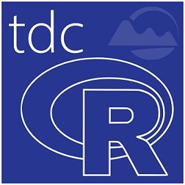

# tdcR
General purpose package for data importing for workflows. 
Primarily interacting with Hilltop Server in subsequently visualise and analyse environmental data.

## Getting Started 
In R make sure that you have devtools installed.

devtools::install_github("mogd001/tdcR") 

## Authors
Matt Ogden (mogd001)

## License
This project is licensed under the MIT License.
